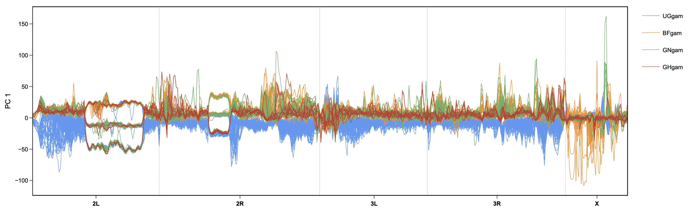

# _WinPCA_

A package for windowed principal component analysis.
WinPCA performs principal component analyses (PCA) in sliding windows along chromosomes. Both hard-called genotypes (input: VCF or TSV) or genotype likelihoods (input: VCF, TSV or BEAGLE) encoding **biallellic SNPs** are accepted. WinPCA uses [scikit-allel](https://scikit-allel.readthedocs.io/en/stable/stats/decomposition.html?highlight=pca) to perfom PCAs on genotype data and [PCAngsd](https://github.com/Rosemeis/pcangsd) methods for genotype likelihood (GL, PL) data.

WinPCA can aid the initial exploration of new datasets since no prior grouping of input samples is necessary to visualize genetic structure. It has also been used to [identify chromosome-scale inversions in cichlids and to visualize the recombination landscape in a species cross](https://www.biorxiv.org/content/10.1101/2024.07.28.605452v2.full) (Fig. 2) or to [identify ancestry tracts in a hybrid mouse](https://www.biorxiv.org/content/10.1101/2024.08.31.610610v2.full) (Fig. 6).


<br />
<br />


# Installation

### _Dependencies_
Please ensure to have these dependencies installed and accessible from your current shell environment: Python packages: [numpy](https://anaconda.org/anaconda/numpy), [pandas](https://anaconda.org/anaconda/pandas), [numba](https://anaconda.org/anaconda/numba), [scikit-allel](https://anaconda.org/conda-forge/scikit-allel), [plotly](https://anaconda.org/plotly/plotly):
```
mamba install numpy pandas numba scikit-allel plotly
```

Additionally, to run WinPCA on genotype likelihood (GL/PL) data: [PCAngsd](https://github.com/Rosemeis/pcangsd) (installation instructions included).
<br />
<br />

### _Obtain WinPCA_
```
git clone https://github.com/MoritzBlumer/winpca.git  # clone github repository
chmod +x winpca/winpca                                # make excutable
```
<br />

# Quick start
_Minimal command line to visualize PC 1 along a chromosome (using GT data from a VCF)_:
<br />

```
# windowed PCA with default settings
winpca pca PREFIX VCF_PATH CHROM_NAME:1-CHROM_SIZE

# make a plot of principal component 1 and color by inversion state
winpca chromplot PREFIX CHROM_NAME:1-CHROM_SIZE -m METADATA_PATH -g METADATA_COLUMN_NAME
```


_Please refer to the help messages (winpca {method} -h) or to the [wiki](https://github.com/MoritzBlumer/winpca/wiki) for the full documentation, file format specifications, more use cases and a tutorial to produce the above plot._

<br />


## Preprint
Blumer LM, Good JM & Durbin R (2025). [WinPCA: A package for windowed principal component analysis](https://arxiv.org/abs/2501.11982). arXiv, 2501.11982.

## Contact

Moritz Blumer: lmb215@cam.ac.uk

